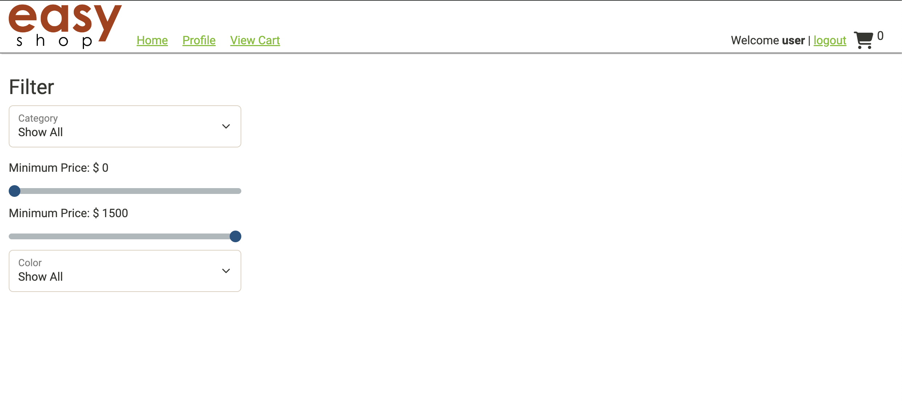
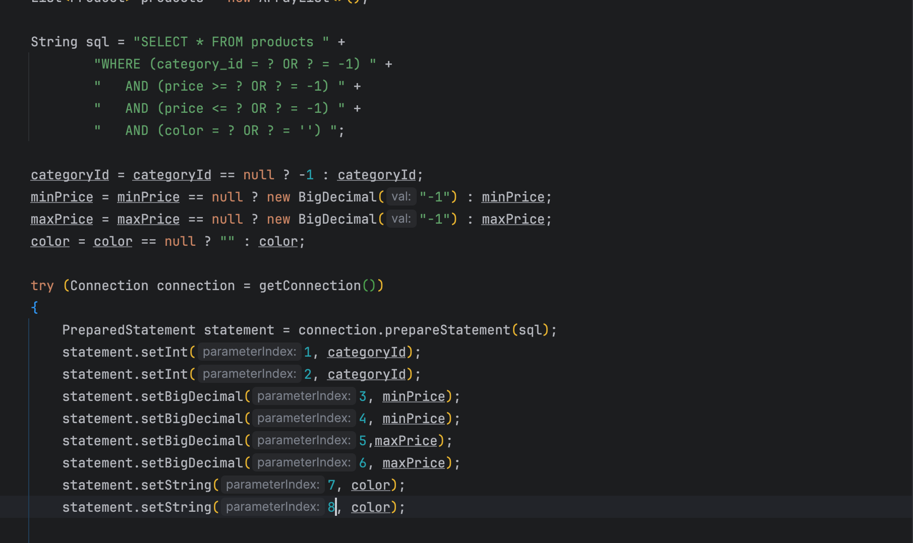
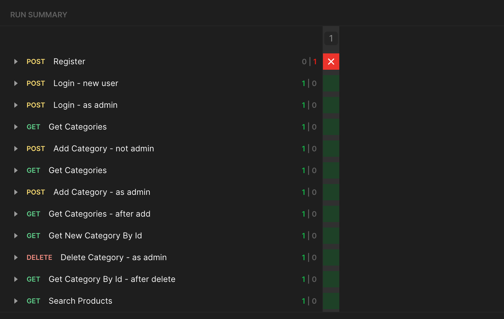

# EasyShop

# My Project overview

============================

For this capastone we where giving a project that was already started, it's a E-commerce website. I had to make sure the website was connected to the database and be able to pull the products from the database provided. I made sure to look over the code provided and see what was missing to be able to display the products on the website. I also had to go through the code and make sure to find specific bugs that was making the website crash.

This is how I got the website, nothing was loading and no products are being shown I was going over the code to see what the problem was

After I implemeted the code to solve the following problems I was finally able to display the products and let the customer see what we had in our shop and they also had the options to toggle through specific products if there was a certian item they was looking for.

Once the user is logged in it gives them a option to start adding items into their cart. This option is only available to users who have signed in a created a account

In the code provided above the following bug I had found in this piece of code is related to the maxPrice it wasn't inlcuded in the prepared statement method and I had to add it to the code to be able to pass my postman products test

All the tests provided in the screenshot shows all the tests I had to pass to get the website to fully run and display all the products. Once I passed one test I went to the others until all of them passed to ensure my website and database was providing the products for the users
